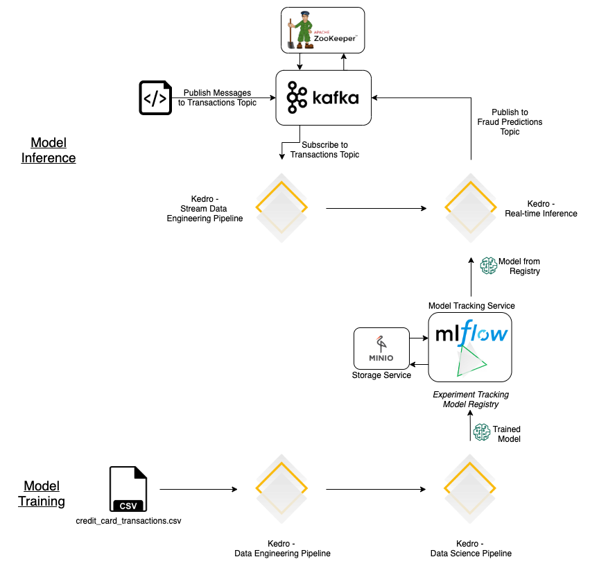

# kedro-streaming

## Overview

This repository serves as an introduction to Spark Streaming combined with Kedro. The infrastructure needed to enable
streaming has all been defined in `docker-compose.yml`.

There are two pipelines defined, emulating a real-life scenario:

- `kedro run --pipeline train` - This pipeline takes care of data engineering, training a ML model, publishing it to
  MLFlow, and running validation.
- `kedro run --pipeline inference` - This pipeline is responsible for inference. It does data engineering on streaming
  data, loads the ML model from MLFlow, and prints the outputted predictions as a stream to the console.
  (A Kafka Topic can also be configured)

## Architecture



We use Minio as an abstraction to a blob storage. Buckets that are defined here can be aliased to real S3 buckets for
production scenarios. For the MLFlow metadata store, we use a `mysql` server. Kafka is used to handle the streaming
architecture.

## Pre-requisites
* A Docker installation, and basic understanding of Docker and micro-services.
* Kedro, and how Kedro Pipelines work

## Step-by-step Instructions

1. Build the `mlflow_server` Docker Image.

```bash
docker build -t mlflow_server:latest -f Dockerfile.mlflow .
```

2. Start the Multi-container application.

```bash
docker-compose up
```

**Services**

| Service    | Host      | Port  |
| ---------- | --------- | ----- |
| Kafka      | localhost | 19092 |
| MLFlow     | localhost | 5000  |
| Minio (S3) | localhost | 9000  |

3. Create a new Conda Environment, and install all Python dependencies

```bash
conda create -n kedro-streaming python=3.7 && conda activate kedro-streaming && pip install -e src/
```

4. Run the Kedro Pipeline to train the model, and publish the model to the model registry in MLFlow.

```bash
kedro run --pipeline train
```

5. Run the Kedro Pipeline for spinning up the inference engine, which will do predictions on data, as it comes in.
   The StreamingSparkDataset is defined to read from the `hello-fraud` Kafka topic. The pipeline is currently configured
   to print to the console. But various other
   [sinks](https://spark.apache.org/docs/latest/structured-streaming-programming-guide.html#output-sinks) can be defined.

```bash
kedro run --pipeline inference
```

6. Now that you have the inference engine up, to test it, we need to produce some messages for the inference pipeline to
   consume in real-time. [notebooks/message_sender.ipynb](./notebooks/message_sender.ipynb) contains a sample of how
   messages can be produced, and sent to the defined `hello-fraud` Kafka topic.
